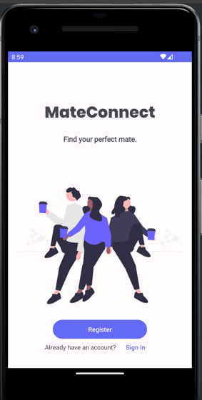

# macs-12

## Group Members 

Sarthak Pandit - B00900388

Sujeet Kc - B00864913

Vaishwi Patel -B00914336

Shamsheer Singh - B00902309

Aishwarya Natrajan - B00882118

Shivam Dinesh Rank - B00897772

## Name

MateConnect

## Description

MateConnect provides the platform for students to carefully assess their companions based on a myriad of similar shared interests and vicinity.

## Stable branch

main

https://git.cs.dal.ca/courses/2022-fall/csci4176_5708/groupproject/macs-12

## Visuals

## Tools Used

1. Firebase Database
2. Firebase Authentication
3. Android Studio IDE
4. Android version 4.0 or later
5. Android SDK 28

## Installation

1. Take a pull from the main branch using "git pull origin main" command
2. Open Android Studio. Installation link - https://developer.android.com/studio 
3. Build project and build.gradle for the dependencies to install. 
4. Set up firebase database - Firestore database. 
5. Run the app on the emulator

## Roadmap

Release 1.1 - 27th November 2022

## Authors and acknowledgment

Sarthak Pandit - B00900388

Sujeet Kc - B00864913

Vaishwi Patel -B00914336

Shamsheer Singh - B00902309

Aishwarya Natrajan - B00882118

Shivam Dinesh Rank - B00897772

## References

[1] “The activity lifecycle &nbsp;: &nbsp; Android developers,” Android Developers. [Online]. Available: https://developer.android.com/guide/components/activities/activity-lifecycle. [Accessed: 27-Nov-2022]. 

[2] “Fragments &nbsp;: &nbsp; android developers,” Android Developers. [Online]. Available: https://developer.android.com/guide/fragments. [Accessed: 27-Nov-2022]. 

[3] Firebase realtime database | store and SYNC data in Real time (no date) Google. Google. Available at: https://firebase.google.com/products/realtime-database?gclid=Cj0KCQjwwfiaBhC7ARIsAGvcPe49TiFYJGYTDEhHJQcOKfgqOF_nAqF-OwinhCfBBrFQSNyoTXyvZ9EaAqiSEALw_wcB&gclsrc=aw.ds (Accessed: October 30, 2022).

[4] “Diagrams.net - free flowchart maker and diagrams online,” Flowchart Maker & Online Diagram Software. [Online]. Available: https://app.diagrams.net/. [Accessed: 30-Oct-2022]. 

[5] Balsamiq Cloud. [Online]. Available: https://balsamiq.cloud/. [Accessed: 30-Oct-2022]. 

[6] A. Chugh, “Android Location API to track your current location,” Digitalocean.com, 03-Aug-2022. [Online]. Available: https://www.digitalocean.com/community/tutorials/android-location-api-tracking-gps. [Accessed: 30-Oct-2022]. 

[7] “Create a notification,” Android Developers. [Online]. Available: https://developer.android.com/develop/ui/views/notifications/build-notification. [Accessed: 30-Oct-2022]. 

[8] “Telephony.Sms,” Android Developers. [Online]. Available: https://developer.android.com/reference/android/provider/Telephony.Sms. [Accessed: 30-Oct-2022].

[9] Sendbird, “How to build in-app chat using Kotlin – Part 2,” Sendbird, 14-Oct-2021. [Online]. Available: https://sendbird.com/developer/tutorials/kotlin-chat-tutorial-part-2. [Accessed: 30-Oct-2022].
